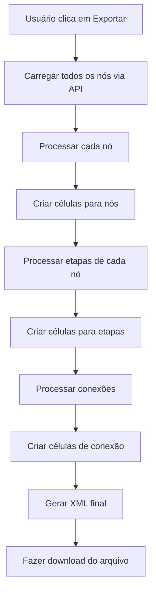

# Exportação para Draw.io - Resources Manager

## 📋 Visão Geral

Este serviço permite exportar todos os nós, etapas e conexões do Resources Manager para um arquivo XML compatível com o Draw.io (agora diagrams.net), permitindo visualizar e editar os fluxos de trabalho em uma interface gráfica externa.

## 🚀 Como Usar

### 1. Exportar Dados
1. Clique no botão de download (📥) na barra superior da aplicação
2. O sistema irá:
   - Carregar todos os nós do sistema
   - Gerar um arquivo XML compatível com Draw.io
   - Fazer o download automaticamente

### 2. Abrir no Draw.io
1. Acesse [app.diagrams.net](https://app.diagrams.net)
2. Clique em "Open Existing Diagram"
3. Selecione o arquivo `.drawio` baixado
4. O diagrama será carregado com todos os nós e conexões

## 🎨 Elementos Visuais

### Nós (Retângulos Azuis)
- **Cor**: Azul claro (#dae8fc)
- **Conteúdo**: 
  - Nome do nó
  - Descrição
  - Workflows associados
  - Número de etapas
- **Estilo**: Retângulo arredondado com borda azul

### Etapas (Formas Coloridas)
- **Processo** (Verde): Retângulo verde (#d5e8d4)
- **Decisão** (Amarelo): Losango amarelo (#fff2cc)
- **Paralelo** (Roxo): Retângulo roxo (#e1d5e7)
- **Conteúdo**:
  - Nome da etapa
  - Tipo (Processo/Decisão/Paralelo)
  - Descrição
  - Número de conexões

### Conexões (Setas)
- **Estilo**: Setas ortogonais com labels
- **Labels**: Condições ou descrições das conexões
- **Cores**: Padrão do Draw.io

## 📊 Estrutura do XML

O arquivo XML gerado segue o formato padrão do Draw.io:

```xml
<?xml version="1.0" encoding="UTF-8"?>
<mxfile host="app.diagrams.net" modified="..." agent="Resources Manager Export">
  <diagram name="Resources Manager Export">
    <mxGraphModel>
      <root>
        <mxCell id="0" />
        <mxCell id="1" parent="0" />
        <!-- Células dos nós, etapas e conexões -->
      </root>
    </mxGraphModel>
  </diagram>
</mxfile>
```

## 🔧 Funcionalidades Técnicas

### Serviço DrawioExportService

#### Métodos Principais:
- `exportToDrawioXml(nodes: Node[]): string` - Gera XML a partir dos nós
- `downloadXml(xml: string, filename: string): void` - Faz download do arquivo

#### Estruturas de Dados:
- `DrawioCell` - Representa uma célula no diagrama
- `DrawioDiagram` - Estrutura do diagrama completo
- `DrawioXml` - XML final formatado

### Layout Automático
- **Nós**: Posicionados verticalmente com espaçamento de 150px
- **Etapas**: Posicionadas abaixo dos nós com offset de 50px
- **Conexões**: Conectam automaticamente nós às etapas e etapas entre si

### Informações Incluídas
- ✅ Nome e descrição dos nós
- ✅ Workflows associados
- ✅ Contagem de etapas
- ✅ Nome e descrição das etapas
- ✅ Tipo das etapas (processo/decisão/paralelo)
- ✅ Conexões entre etapas
- ✅ Condições das conexões
- ✅ Contagem de conexões

## 🎯 Casos de Uso

### 1. Documentação Visual
- Criar diagramas para documentação
- Compartilhar fluxos com stakeholders
- Apresentar arquitetura do sistema

### 2. Análise de Fluxos
- Identificar gargalos nos processos
- Analisar dependências entre nós
- Otimizar fluxos de trabalho

### 3. Colaboração
- Editar diagramas em equipe
- Adicionar anotações e comentários
- Criar versões alternativas

## 🔄 Fluxo de Exportação



## 📝 Exemplo de Uso

```typescript
// No componente
constructor(private drawioExportService: DrawioExportService) {}

exportToDrawio(): void {
  this.apiService.getNodes().subscribe({
    next: (response) => {
      const nodes = response.data;
      const xml = this.drawioExportService.exportToDrawioXml(nodes);
      const filename = `export-${new Date().toISOString().split('T')[0]}.drawio`;
      this.drawioExportService.downloadXml(xml, filename);
    }
  });
}
```

## 🎨 Personalização

### Cores e Estilos
Os estilos são definidos no serviço e podem ser personalizados:

```typescript
// Estilo para nós
style: 'rounded=1;whiteSpace=wrap;html=1;fillColor=#dae8fc;strokeColor=#6c8ebf;'

// Estilo para etapas de processo
style: 'rounded=1;whiteSpace=wrap;html=1;fillColor=#d5e8d4;strokeColor=#82b366;'

// Estilo para etapas de decisão
style: 'rhombus;whiteSpace=wrap;html=1;fillColor=#fff2cc;strokeColor=#d6b656;'
```

### Layout
- Largura dos nós: 200px
- Altura dos nós: 100px
- Largura das etapas: 150px
- Altura das etapas: 80px
- Espaçamento vertical: 150px
- Offset das etapas: 50px

## 🚨 Limitações Atuais

1. **Layout Fixo**: Posicionamento automático simples
2. **Sem Agrupamento**: Não agrupa nós por workflow
3. **Conexões Limitadas**: Apenas conexões diretas entre etapas
4. **Sem Propriedades**: Propriedades customizadas não são exibidas

## 🔮 Melhorias Futuras

1. **Layout Inteligente**: Algoritmo de posicionamento automático
2. **Agrupamento**: Agrupar nós por workflow
3. **Propriedades**: Incluir propriedades customizadas
4. **Temas**: Múltiplos temas visuais
5. **Filtros**: Exportar apenas nós selecionados
6. **Importação**: Importar diagramas editados de volta

## 📞 Suporte

Para dúvidas ou problemas com a exportação:
1. Verifique se todos os nós estão carregados
2. Confirme se o arquivo foi baixado corretamente
3. Teste abrindo o arquivo no Draw.io
4. Verifique o console do navegador para erros
